# ZLWL 智聆未来 — 项目总结与说明文档

> 最后更新：2026-07-22  
> 后端：FastAPI + MariaDB + Cloudflare Tunnel  
> 前端：微信原生小程序  
> 服务器：阿里云 ECS (Alibaba Cloud Linux 4) · root@47.116.193.74

---

## 一、项目概述

ZLWL（智聆未来）是一个 AI 驱动的英语学习助手微信小程序。核心功能包括 AI 聊天（流式 + Markdown）、语音评测（讯飞 ISE）、口语对练（Qwen-Omni 多模态）、AI 图片/示意图生成、文件上传与智能分析、用户记忆管理等。

---

## 二、系统架构

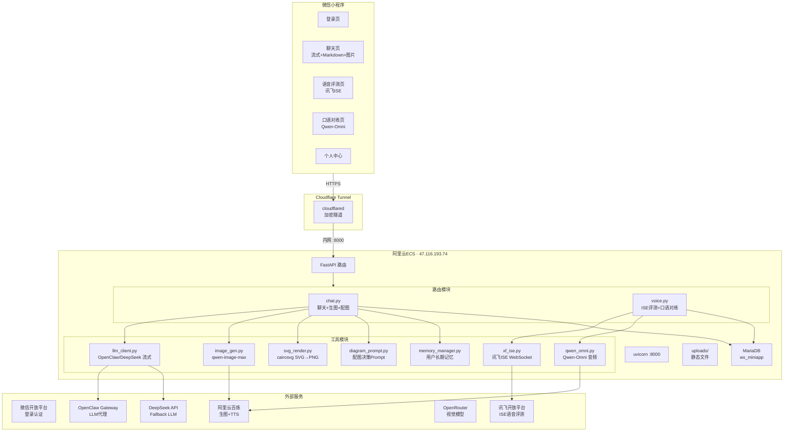

### 技术栈总览

| 层 | 技术 | 说明 |
|------|------|------|
| 前端 | 微信原生框架 | WXML/WXSS/JS，自定义 TabBar、组件化 |
| 后端框架 | FastAPI + uvicorn | 异步路由、流式响应、StaticFiles |
| 数据库 | MariaDB | 会话/消息/记忆/评测记录/用户 |
| LLM 网关 | OpenClaw | DeepSeek → OpenClaw 代理，fallback 直连 |
| 视觉模型 | OpenRouter qwen3-vl | 图片内容描述 |
| 语音评测 | 讯飞 ISE WebSocket | 英文口语评测，逐词打分 |
| 音频对话 | Qwen3.5-Omni-Flash | 语音→文本识别 |
| TTS | Qwen3-TTS-Flash | 文本→语音合成，多音色 |
| 图片生成 | Qwen-Image-Max | 百炼 MaaS，创意配图 |
| SVG 渲染 | cairosvg + Cairo | 服务端 SVG→PNG，示意图输出 |
| 部署 | Cloudflare Tunnel | 绕过阿里云 ICP 备案拦截 |

---

## 三、后端功能详解

### 3.1 AI 聊天（chat.py + llm_client.py）

**功能**：多轮对话，流式输出，Markdown 渲染，自动配图，图片生成

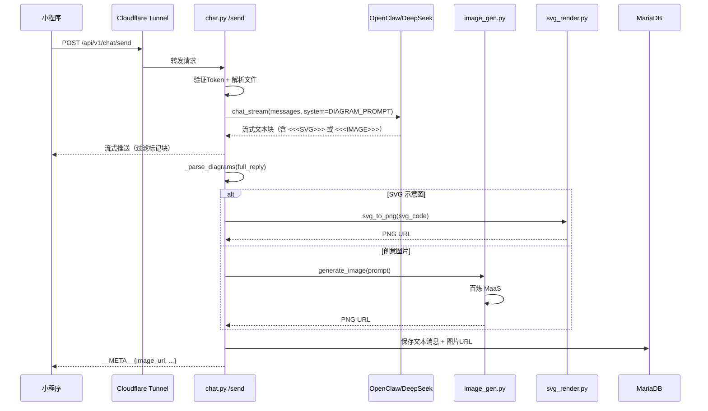

**关键点**：
- System Prompt 包含配图决策指令（`diagram_prompt.py`）
- LLM 输出 `<<<SVG>>>...<<<END>>>` 或 `<<<IMAGE>>>...<<<END>>>` 标记
- 流式状态机实时过滤标记块，不泄露给前端
- SVG → cairosvg 渲染 PNG，IMAGE → qwen-image-max 生成 PNG
- 图片 URL 同时写入 DB（`messages` 表），跨设备可查看

**踩坑记录**：
| 问题 | 原因 | 解决 |
|------|------|------|
| SVG 源码出现在气泡 | 初始版本直接流式透传标记块 | 状态机缓冲检测 + 实时过滤 |
| PNG 不下发到前端 | `generate()` 函数 Phase 3/4 代码丢失 | 补回保存+META 下发 |
| 换手机看不到图片 | 图片 URL 只存在 META 流中，未入库 | `msg_db.save(cid, "assistant", url)` 入库 |
| 数学符号变方框 | 服务器缺少中文字体和数学符号字体 | 安装 Noto Sans CJK SC + Math + Symbols |
| "画一匹马"只出文字 | prompt 未区分 SVG/IMAGE 路径 | 重写 prompt，类型B 只输出标记块 |
| LLM 忘写 `<<<END>>>` | LLM 格式遵守不稳定 | `_parse_diagrams` 兜底匹配未闭合块 |
| 图片请求仍传提示词文本 | LLM 对 IMAGE 类型也写前置文字 | prompt 明确"类型B禁止文字前置" |

---

### 3.2 流式输出机制

**架构**：

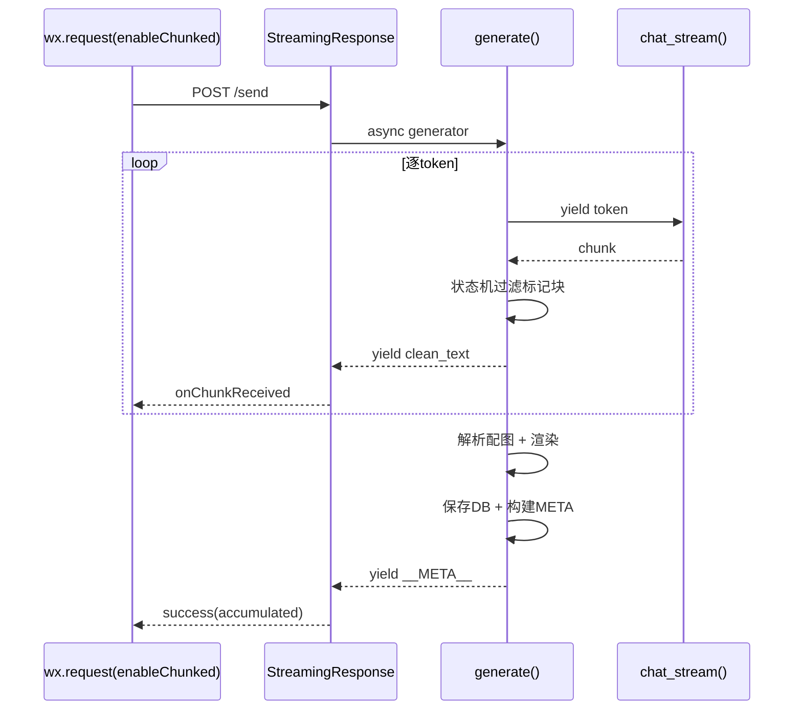

**关键代码**：
- 后端 `StreamingResponse(generate(), media_type="text/plain")`
- 前端 `wx.request({ enableChunked: true, ... })` + `onChunkReceived`
- 流式文本累积，`__META__` 在末尾一次性下发

---

### 3.3 语音评测（voice.py + xf_ise.py）

**功能**：英语口语评测，逐词打分（0-100），完整度/流利度/准确度

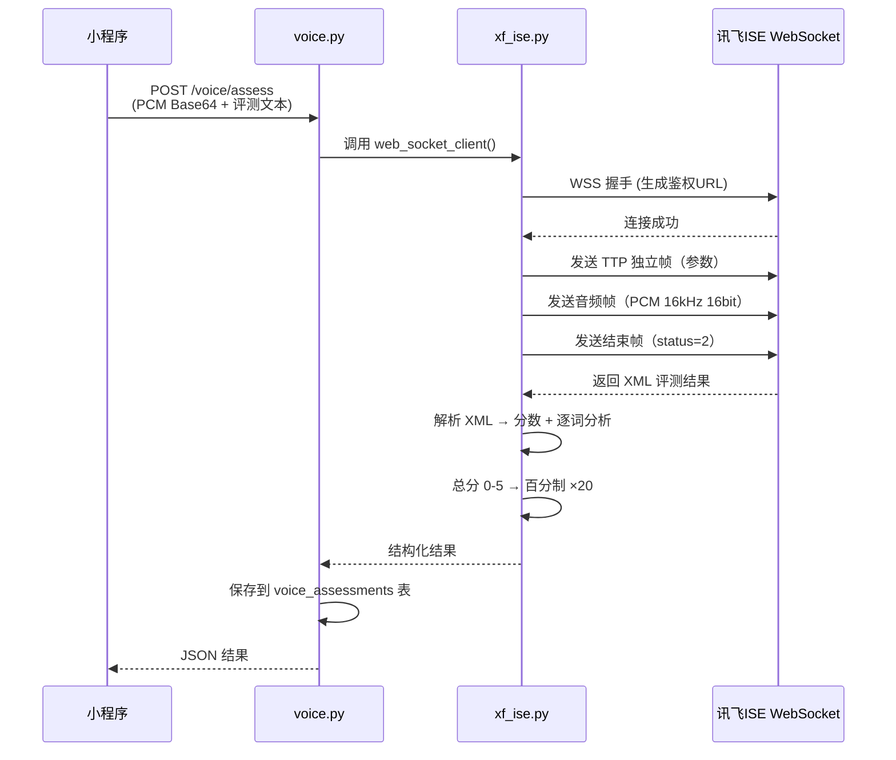

**踩坑记录**：
| 问题 | 原因 | 解决 |
|------|------|------|
| 401/403 鉴权失败 | 讯飞 API Key/Secret 不匹配或过期 | 确认 ISE_APP_ID 与 Key 对应，APIKey/APISecret 用控制台值 |
| 48195 音频格式错误 | 音频参数与评测模式不匹配 | read_sentence 模式用 16kHz/16bit/PCM |
| 60114 文本过长 | 评测文本超过模式限制 | 限制 60 字以内 |
| 完整度评分极低（~20分） | 服务端 PCM 被截断（160000/200000 字节限制） | 移除 xf_ise.py 中 PCM 长度截断 |
| 逐词分析全绿色 | read_sentence 模式 dp_message 均为 0 | 按实际分数分级着色：≥85绿/60-84黄/<60红 |
| Cloudflare WAF 403 | voice 路由被安全规则拦截 | 切回 base64+JSON 方式，CF 安全级别调低 |

---

### 3.4 口语对练（voice.py + qwen_omni.py）

**功能**：多模态音频对话，用户录音 → AI 语音回复

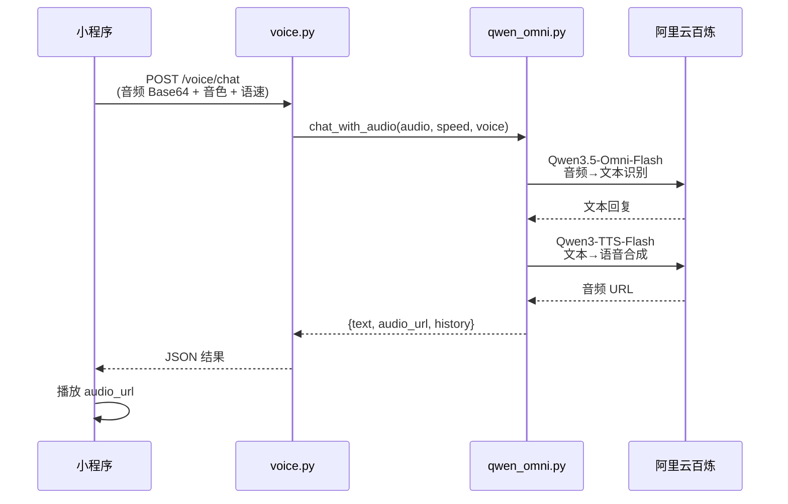

**关键决策**：
- 选用 HTTP 模式（非 WebSocket Realtime）：后者需要复杂双向实时流，HTTP 模式延迟 ~2s 可接受
- TTS 单独调用 qwen3-tts-flash：omni 模型不直接输出音频
- 音色支持 Cherry/Kai/Eric，语速 0.8-2.0x 五档

**踩坑记录**：
| 问题 | 原因 | 解决 |
|------|------|------|
| 请求失败/服务崩溃 | qwen_omni.py 语法错误 | 修复 import 和异步调用 |
| 录音编码错误 | encodeBitRate: 256000 参数不支持 | 移除不支持的编码参数 |
| 音频播放失败 | TTS URL 格式或 content-type 不对 | 检查 API 返回格式 |

---

### 3.5 图片生成（image_gen.py）

**功能**：调用百炼 MaaS 的 qwen-image-max 生成创意图片

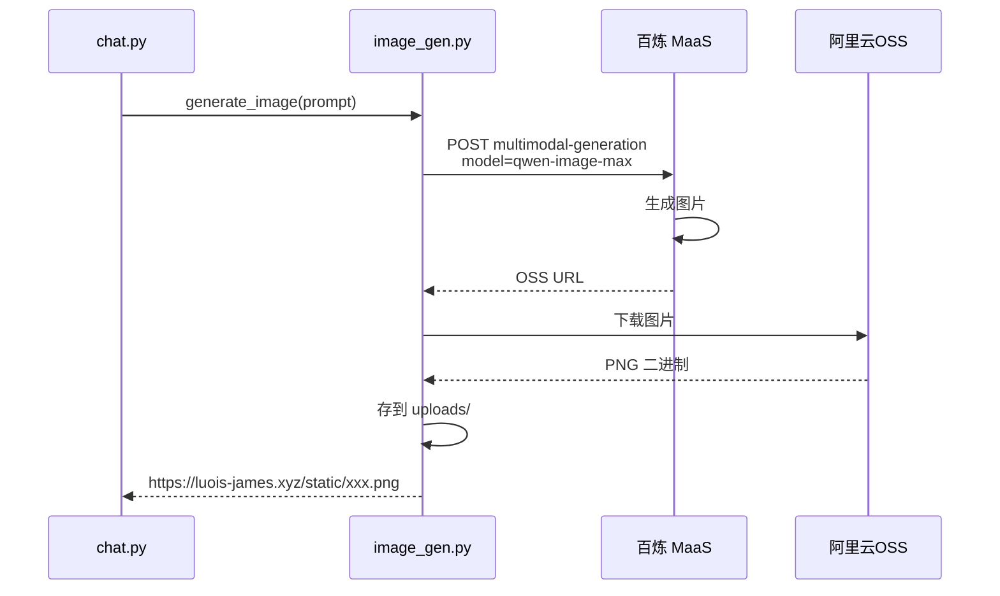

**模型选型**（均测试通过）：

| 模型 | 耗时 | 状态 |
|------|------|------|
| qwen-image-3.0-pro | — | 403 无权限 |
| **qwen-image-max** | ~13s | ✓ 选用 |
| qwen-image-2.0-pro | ~16s | ✓ |
| wan2.7-image-pro | ~23s | ✓ |
| z-image-turbo | ~3.8s | 速度快但质量低，已弃用 |

---

### 3.6 SVG 示意图渲染（svg_render.py）

**功能**：LLM 生成的 SVG 代码 → 服务端渲染 PNG

```
LLM 输出 <<<SVG>>><svg>...</svg><<<END>>>
        │
        ▼ _parse_diagrams()
  提取 SVG 源码
        │
        ▼ svg_to_png()
  cairosvg.svg2png()
        │
        ▼
  uploads/diagram_xxx.png
        │
        ▼
  https://luois-james.xyz/static/diagram_xxx.png
```

**依赖**：
- 系统库：cairo, cairo-devel
- Python：cairosvg 2.9.0
- 字体：Noto Sans CJK SC, Noto Sans Math, Noto Sans Symbols, Noto Sans Symbols2

**踩坑**：数学符号变方框 → 安装数学字体 + SVG 内嵌 `<style>` 指定 font-family

---

### 3.7 文件上传与分析（chat.py）

**功能**：上传图片/文件 → AI 自动读取内容后回复

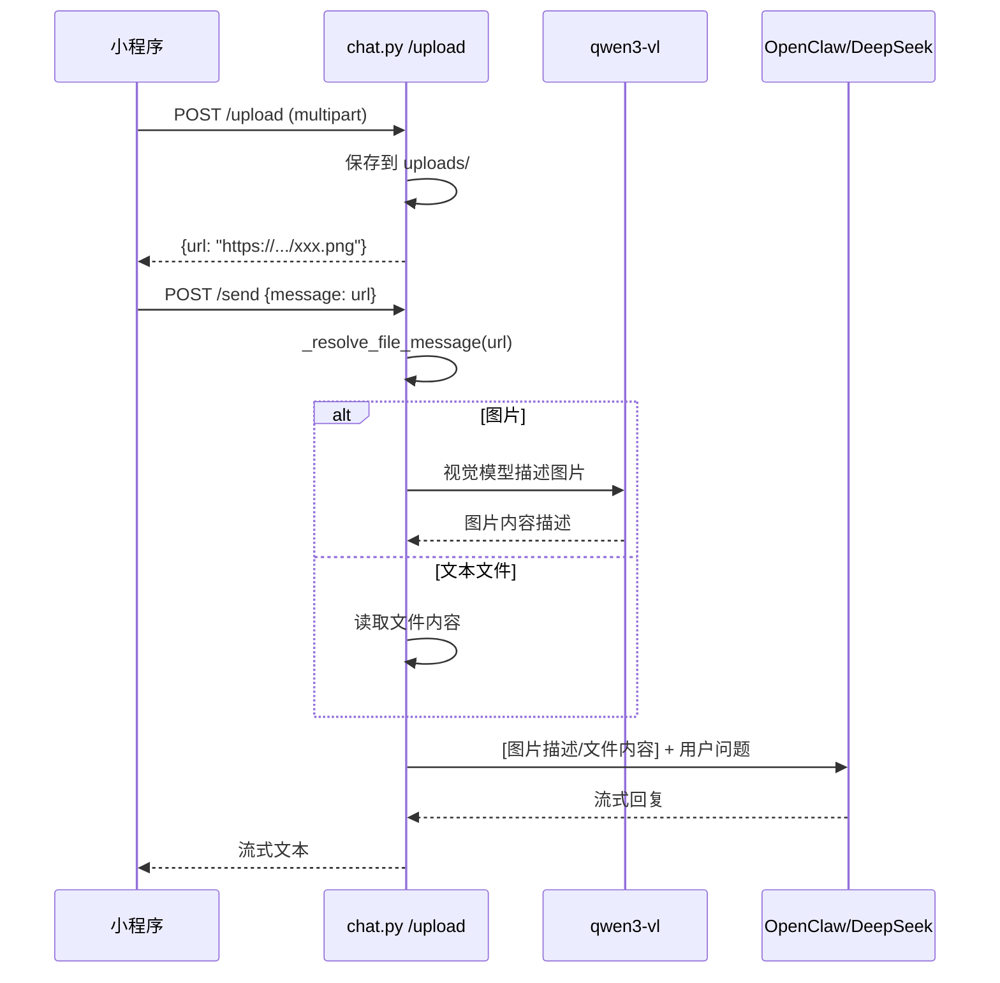

**支持格式**：
- 文本：.txt, .md, .py, .js, .json, .csv, .yaml, .log 等 30+ 扩展名
- 图片：.jpg, .png, .gif, .webp 等（通过 qwen3-vl 视觉模型描述）
- 文件大小限制：文本 6000 字符预览

---


### 3.10 LaTeX 公式渲染代理（latex_proxy.py）

**功能**：代理 codecogs 渲染 LaTeX 公式 SVG，本地缓存

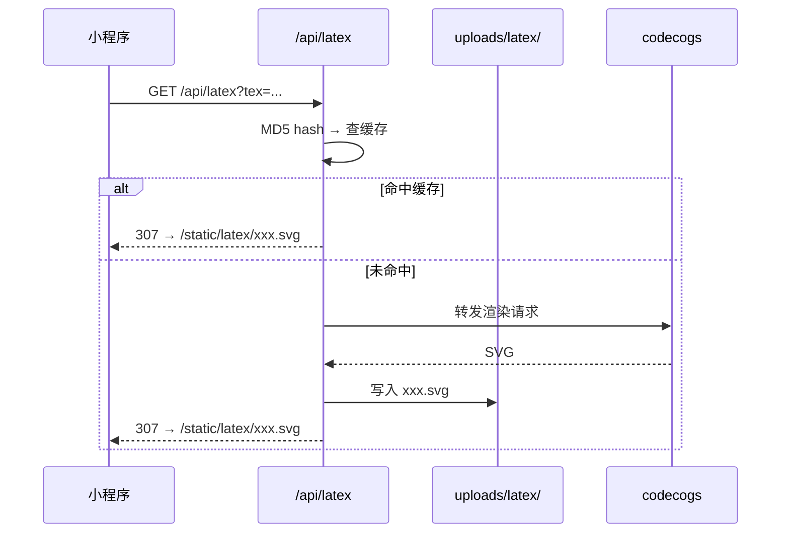

**关键点**：
- 公式首次请求转发 codecogs，后续命中本地缓存
- 前端 towxml config 指向 `https://luois-james.xyz/api/latex?tex=`
- 缓存目录 `uploads/latex/`，通过 `/static/latex/` 暴露
- 彻底消除对第三方服务的实时依赖

**踩坑**：
| 问题 | 解决 |
|------|------|
| codecogs 不支持中文 | prompt 禁止 LaTeX 公式中使用中文 |
| 原 towxml API 是 HTTP | 改用自建 HTTPS 代理 |
| 首次加载慢 | 本地缓存 SVG，二次请求秒出 |


### 3.8 用户记忆管理（memory_manager.py）

**功能**：自动从对话中提取用户事实，长期记忆，压缩旧记忆

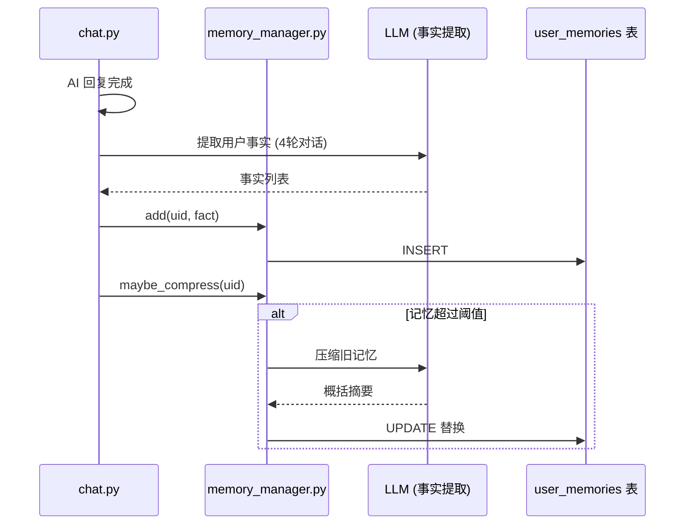

**注入时机**：每次 LLM 调用时，`build_context(uid)` 将用户记忆拼入 System Prompt

---

### 3.9 用户统计（stats.py）

**功能**：个人中心数据统计

- 总消息数
- 总会话数
- 评测次数 & 平均分
- 记忆条数

---

## 四、前端功能详解

### 4.1 登录页（pages/login）

**流程**：`wx.login()` → 后端 `/auth/login` → 获取 token → 存入 storage

**踩坑**：DEV_SKIP_LOGIN 模式下绕过真实登录，开发时需关闭 `USE_MOCK`

---

### 4.2 聊天页（pages/chat + components）

**核心组件**：

| 组件 | 说明 |
|------|------|
| `pages/chat/chat` | 主页面：会话列表、消息列表、输入发送 |
| `components/message-bubble` | 消息气泡：文本/Markdown/图片/文件展示 |
| `components/chat-input` | 输入框：文字、文件选择、编辑回填 |
| `custom-tab-bar` | 自定义底部导航（4 Tab） |

**数据流**：

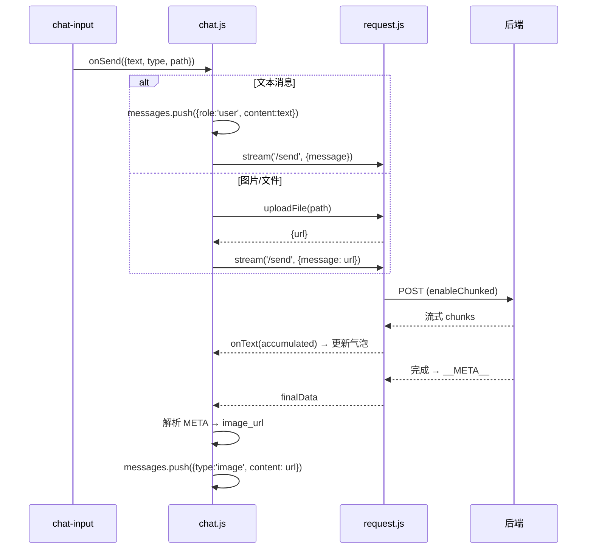

**消息气泡渲染**：
- AI 消息：`rich-text` 渲染 Markdown → HTML
- 图片消息：`<image>` 组件，支持预览
- 文件消息：文件卡片，显示文件名
- Markdown 支持：标题、粗体、代码块、表格、引用、列表、LaTeX公式→Unicode

**操作功能**：
- 编辑用户消息（回填输入框重新发送）
- 复制 AI 消息
- 分享消息
- 长按批量选择 → 删除

**踩坑**：
| 问题 | 解决 |
|------|------|
| 图片上传后 AI 说"看不到" | `_resolve_file_message()` 调用视觉模型描述图片 |
| 历史图片显示为 URL | `detectMessageType()` 自动检测 URL 类型 |
| Markdown 公式不渲染 | `latexToUnicode()` 将 $...$ 转 Unicode 字符 |
| 流式消息闪烁 | 先插入占位 "…" 再逐 token 更新 |

---

### 4.3 语音评测页（pages/voice）

**功能**：录音 → 上传 → 评测结果展示

- PCM 格式录音（16kHz 采样率）
- 结果展示：总分、逐词评分（三档着色）、完整度/流利度/准确度
- 图例：🟢优秀(≥85) 🟡良好(60-84) 🔴需改进(<60)

**踩坑**：
- 录音权限：需声明 `scope.record` 并前置检查
- Cloudflare 403：多媒体上传被 WAF 拦截，改用 base64+JSON
- 编码参数：移除不支持的 `encodeBitRate`

---

### 4.4 口语对练页（pages/speak）

**功能**：按住录音 → 发送音频 → AI 语音回复自动播放

- 录音按钮（点击开始/停止）
- 字幕滚动区
- 音色选择：Cherry / Kai / Eric
- 语速选择：0.8x / 1.0x / 1.2x / 1.5x / 2.0x（按钮方式）
- AI 回复自动播放 `audio_url`

---

### 4.5 个人中心（pages/profile）

**功能**：
- 头像上传（先传到服务器再存 DB）
- 统计卡片（消息/会话/评测 数量）
- 评测历史列表
- AI 记忆管理（查看/删除）
- 清除记录（双重确认弹窗）
- 关于页面

---

## 五、数据模型

### 数据库表结构

| 表名 | 说明 | 关键字段 |
|------|------|------|
| `wx_users` | 微信用户 | id, wx_openid, nickname, avatar_url |
| `user_sessions` | 登录会话 | id, user_id, token, expires_at |
| `conversations` | 聊天会话 | id, user_id, title, created_at |
| `messages` | 聊天消息 | id, conversation_id, role, content |
| `user_memories` | 用户长期记忆 | id, user_id, content, compressed |
| `voice_assessments` | 语音评测记录 | id, user_id, text, score, detail |

**注意**：messages 表无 `type` 字段，前端通过 `detectMessageType()` 自动判断——内容以 `https://luois-james.xyz/static/` 开头且扩展名为图片格式即识别为图片消息。

---

## 六、部署架构

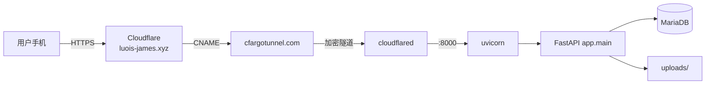

### Cloudflare Tunnel 配置

| 配置项 | 值 |
|------|------|
| Tunnel UUID | 626935f4-443b-4d6b-a47a-2f36fc484e9d |
| 域名 | luois-james.xyz |
| DNS 类型 | CNAME → `<uuid>.cfargotunnel.com` |
| SSL/TLS | Full |
| 系统服务 | `/etc/systemd/system/cloudflared.service` |

### 为什么用 Tunnel？

阿里云国内 ECS 未 ICP 备案，端口 80/443 HTTP 流量会被阿里云拦截返回"未备案"页面。Cloudflare Tunnel 使用加密 WebSocket 隧道，阿里云无法检测 Host 头，从而绕过备案限制。

### 踩坑：服务器迁移

从旧服务器 117.69.252.58（dfzz 账号）迁移到 47.116.193.74（root 账号）：
- DNS A 记录 → CNAME 指向 Tunnel
- 旧服务器 cloudflared 必须停止（避免冲突）
- SSL/TLS 模式从 Flexible → Full
- 代码直接 scp 迁移，`__pycache__` 必须清理

### 重启命令

```bash
# 重启后端
pkill -9 -f 'uvicorn app.main'
rm -rf /opt/wx-miniapp-ai/server/app/**/__pycache__
cd /opt/wx-miniapp-ai/server
nohup python3 -m uvicorn app.main:app --host 127.0.0.1 --port 8000 > logs/uvicorn.log 2>&1 &

# 查看日志
tail -f /opt/wx-miniapp-ai/server/logs/uvicorn.log
```

---

## 七、踩坑汇总

| # | 类别 | 问题 | 根因 | 解决方案 |
|------|------|------|------|------|
| 1 | ISE | 401 鉴权失败 | API Key/Secret 与 APP_ID 不匹配 | 使用控制台正确凭据 |
| 2 | ISE | 48195 音频错误 | 格式/采样率不匹配 | 16kHz 16bit PCM |
| 3 | ISE | 60114 文本过长 | 评测文本超 60 字 | 前端限制 + 截断 |
| 4 | ISE | 完整度 ~20 分 | PCM 被服务端截断 | 移除 xf_ise.py 的长度限制 |
| 5 | ISE | 逐词全绿 | dp_message 在 read 模式全 0 | 按分数三档着色 |
| 6 | 部署 | Cloudflare 403 | voice 路由被 WAF 拦截 | base64+JSON 替代 multipart |
| 7 | 部署 | ICP 备案拦截 | 阿里云检测 HTTP Host 头 | Cloudflare Tunnel 加密隧道 |
| 8 | 聊天 | SVG 源码在气泡显示 | 标记块直接被流式推送 | 状态机缓冲实时过滤 |
| 9 | 聊天 | PNG 没下发到前端 | generate() 函数代码不完整 | 补回 Phase 3(保存) + Phase 4(META) |
| 10 | 聊天 | 换设备图片丢失 | 图片 URL 只存在流 META 中 | 入库 messages 表 |
| 11 | 渲染 | 数学符号变方框 □ | 服务器缺中文字体 | 安装 Noto Sans CJK SC + Math |
| 12 | 渲染 | 前端公式不显示 | rich-text 不支持 LaTeX | 前端 latexToUnicode() 转换 |
| 13 | LLM | "画一匹马" 不出图 | prompt 未区分 SVG/IMAGE | 重写 prompt，增加判断优先级 |
| 14 | LLM | "已生成图片" 但无实际输出 | LLM 幻觉 | prompt 明确禁止，增加兜底解析 |
| 15 | LLM | 图片附带文字描述 | prompt 允许 IMAGE 类型写前置 | 改为"类型B禁止文字前置" |
| 16 | 文件 | 图片上传后 AI 说看不到 | 未调用视觉模型 | _resolve_file_message() → qwen3-vl |
| 17 | 文件 | 历史文件显示为 URL | 缺少类型检测 | detectMessageType() 自动判断 |
| 18 | 服务器 | 迁移后服务 502 | 旧 cloudflared 仍在运行 | 停旧启新 + DNS 改为 CNAME |

---

## 八、环境变量（.env 示例）

```bash
# 微信
WX_APPID=wxb81645ad7e110063
WX_SECRET=[REDACTED]

# 数据库
DB_HOST=localhost
DB_PORT=3306
DB_USER=miniapp
DB_PASSWORD=[REDACTED]
DB_NAME=wx_miniapp

# LLM (DeepSeek fallback)
LLM_API_KEY=[REDACTED]
LLM_BASE=https://api.deepseek.com/v1
LLM_MODEL=deepseek-chat

# OpenClaw Gateway
OPENCLAW_URL=http://127.0.0.1:12178/v1
OPENCLAW_TOKEN=[REDACTED]
OPENCLAW_MODEL=openclaw

# 视觉模型
OPENROUTER_KEY=[REDACTED]
VISION_MODEL=qwen/qwen3-vl-235b-a22b-instruct

# Qwen (百炼 MaaS)
QWEN_API_KEY=[REDACTED]
QWEN_MODEL=qwen3.5-omni-flash

# 讯飞 ISE
ISE_APP_ID=16fe0688
ISE_API_KEY=[REDACTED]
ISE_API_SECRET=[REDACTED]

# 系统
SYSPROMPT=(由 chat.py 动态覆盖)
DEBUG=false
```

---

## 九、文件清单

### 后端 `/opt/wx-miniapp-ai/server/`

```
app/
├── main.py                  # FastAPI 入口，挂载 /static
├── config.py                # 环境变量读取
├── database.py              # DB 连接池
├── routers/
│   ├── chat.py              # 聊天、生图、配图、上传、统计、记忆
│   ├── voice.py             # 语音评测 + 口语对练
│   └── auth.py              # 微信登录
├── models/
│   ├── conversation.py      # 会话 CRUD
│   ├── message.py           # 消息 CRUD
│   ├── session.py           # Token 验证
│   └── stats.py             # 用户统计
├── utils/
│   ├── llm_client.py        # LLM 调用（OpenClaw/DeepSeek 流式）
│   ├── xf_ise.py            # 讯飞 ISE WebSocket 客户端
│   ├── qwen_omni.py         # Qwen-Omni 音频对话 + TTS
│   ├── image_gen.py         # qwen-image-max 图片生成
│   ├── svg_render.py        # cairosvg SVG→PNG 渲染
│   ├── diagram_prompt.py    # 配图决策 System Prompt
│   ├── memory_manager.py    # 用户长期记忆
│   └── auth.py              # Token 验证工具
└── .env                     # 环境变量
```

### 前端 `C:\Users\EDY\Desktop\ZLWL-WX\`

```
pages/
├── chat/chat.*              # 聊天主页
├── voice/voice.*            # 语音评测
├── speak/speak.*            # 口语对练
├── profile/profile.*        # 个人中心
└── login/login.*            # 登录
components/
├── message-bubble/          # 消息气泡
├── chat-input/              # 输入组件
└── custom-tab-bar/          # 底部导航
utils/
├── request.js               # HTTP 请求 + 流式
├── markdown.js              # Markdown→HTML + LaTeX→Unicode
├── storage.js               # 本地存储
└── config.js                # BASE_URL 配置
```

---


---
## 十二、2026-07-23 更新记录

### SVG 示意图纯文件方案

弃用 cairosvg PNG 渲染,改为纯 SVG 文件保存 + markdown 内嵌:

| 文件 | 变更 |
|------|------|
| svg_render.py | 移除 cairosvg 依赖,仅保留 svg_save() 保存原始 SVG |
| chat.py Phase 3 | SVG URL 以 markdown 图片语法嵌入 clean_text |
| chat.py Phase 4 | meta.image_url 仅包含创意图片,SVG 不再放入 |

### SVG 嵌入优化(前端)

| 文件 | 变更 |
|------|------|
| chat.js callChat() | meta 中 .svg 结尾的 URL 跳过独立图片气泡 |
| chat.js loadMessages() | 从 markdown 文本提取 SVG URL,过滤重复图片消息 |
| chat.js loadOlder() | 同上,从已有消息中收集 SVG URL 去重 |
| towxml/img/img.wxml | image 添加 bindtap preview |
| towxml/img/img.js | 新增 preview() 方法调用 wx.previewImage 放大 |

### 优势
- 零失真: 浏览器原生渲染 SVG,支持中文和 LaTeX
- 减少服务端开销: 无 PNG 转换,无 cairosvg 依赖
- 内嵌预览: 点击放大,与 LaTeX 公式体验统一
## 十三、
### 2026-07-23 消息删除四层 bug 修复

| 层 | 问题 | 修复 |
|---|------|------|
| 1 | get_messages 缺 id 字段 | 返回消息增加 id |
| 2 | DELETE 被 Cloudflare 阻断 | 新增 POST /batch_remove 端点 |
| 3 | _cleanup_static_files 正则缺捕获组 | 正则加括号捕获 URL |
| 4 | gen_title 失败不更新 DB | except 中调用 update_title |

### 2026-07-23 深度模式

新增 `/send-deep` 端点 + `deep_agent.py`。LLM 通过 prompt 式 JSON 指令调用 web_search(DuckDuckGo) 和 code_exec(Python sandbox)，最大 5 轮工具循环。前端导航栏切换普通/深度模式，超时 120s。

### 2026-07-24 更新

| 项目 | 内容 |
|------|------|
| 用户文件系统 | 新增 receive/ 目录 + user_files 表，独立管理用户上传 |
| 用户隔离 | system prompt 注入用户名；关闭 OpenClaw session-memory hook |
| 消息删除 | cleanup 同时处理 static/ 和 receive/ 目录 + user_files 表 |
| 深度模式 | Agent 联网搜索(code_exec) + web_search(DuckDuckGo) |
| 新建会话 | POST /conversations 立即创建，解决文件选择器 onShow 跳会话 |

### 文件变更
- chat.py: system prompt 注入用户；_resolve_file_message 支持 receive；upload 改 receive
- message.py: _cleanup_static_files 双目录；delete_by_ids 清 user_files
- conversation.py: 删除会话清 user_files
- file.py: 新增，文件模型
- deep_agent.py: 新增，Agent 工具循环
- main.py: /receive 静态挂载
后续可扩展

1. **PDF 报告生成** — LLM 写内容 → reportlab 生成 PDF → `/static/xxx.pdf` → 前端下载
2. **WebSocket 实时语音** — qwen3.5-omni-flash-realtime 替代 HTTP 轮询，真正双向实时
3. **朗读评测** — read_sentence→read_paragraph→read_passage 多模式
4. **学习报告** — 汇总评测数据 + AI 分析生成学习建议
5. **小程序正式版** — 关闭 DEV_SKIP_LOGIN，走微信审核上线

---


---

## 十一、2026-07-22 更新记录

### 前端 Markdown/LaTeX 渲染升级

放弃自研 `markdown.js` LaTeX 转 Unicode 方案，改为集成 **towxml 3.0**：

| 文件 | 变更 |
|------|------|
| `utils/markdown.js` | 废弃，改用 towxml |
| `components/towxml/` | 新增，towxml 完整组件库 |
| `message-bubble.js` | `towxml(text, 'markdown', {theme:'dark'})` 解析 |
| `message-bubble.wxml` | `<towxml nodes="{{mdNodes}}" />` 替代 `<rich-text>` |
| `message-bubble.json` | 注册 towxml 组件依赖 |

### 踩坑
1. **反斜杠转义地狱**：write_file/SFTP/base64 均破坏 `\` 字符 → 放弃自研，改用 towxml
2. **LaTeX 公式白色不可见**：原 API `towxml.vvadd.com` 是 HTTP 被小程序拦截 → 改用 HTTPS `latex.codecogs.com` + `\color{white}` 前景色适配暗色主题
3. **decode.json 路径**：硬编码 `/towxml/...` → 改为 `/components/towxml/...`
4. **`rac` 渲染失败**：`new RegExp` 在微信 JS 引擎转义行为不同 → 改用 `indexOf` 字符串解析

### SVG 渲染修复
- **字体方框**：移除强制 `font-family` 注入，让 cairo 使用系统默认字体回退链
- **上下标转换**：`svg_render.py` 新增 `_convert_text_spans()` + `_latex_to_unicode()`
- 安装字体：Noto Sans CJK SC、Noto Sans Math、Noto Sans Symbols

### 图片生成模型升级
- `z-image-turbo`（3.8s，速度优先） → `qwen-image-max`（13s，准确度优先）

### 文件清理
- 删除消息/会话时同步删除 `uploads/` 中的关联文件
- `message.py` 新增 `_cleanup_static_files()`
- `conversation.py` 删除时批量清理

### 前端其他优化
- 纯图片生成无气泡占位：`aiIdx = -1` 延迟创建机制
- 流式状态机过滤 `<<<SVG/IMAGE>>>` 标记块
- AI 气泡宽度与用户气泡统一、居中布局、白底黑字


> 本文档随项目持续更新。最后部署时间：2026-07-22
